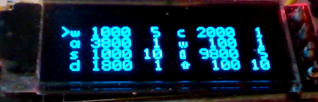

## Butonpresser

An Arduino micro program to press and hold buttons (Mouse and Keyboard) for me.

### Features

- An oled screen displaying current configuration.
- Saving and loading configuration to and from a small eeprom
- Hold keys
- Press keys periodically
- Press keys periodically up to N times
- Supported keys: Alphanumeric a-z, 0-9. Left CTRL, Left ALT and Left Shift. Mouse buttons: Left, right, middle. 

